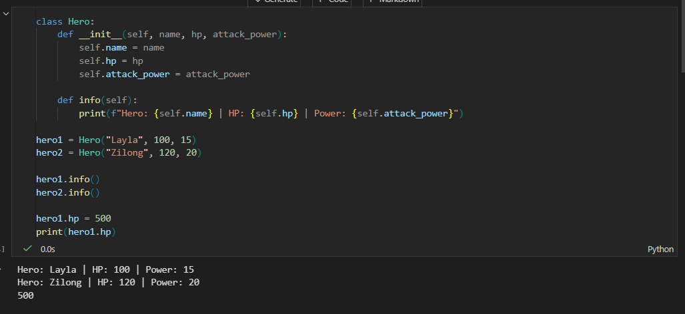
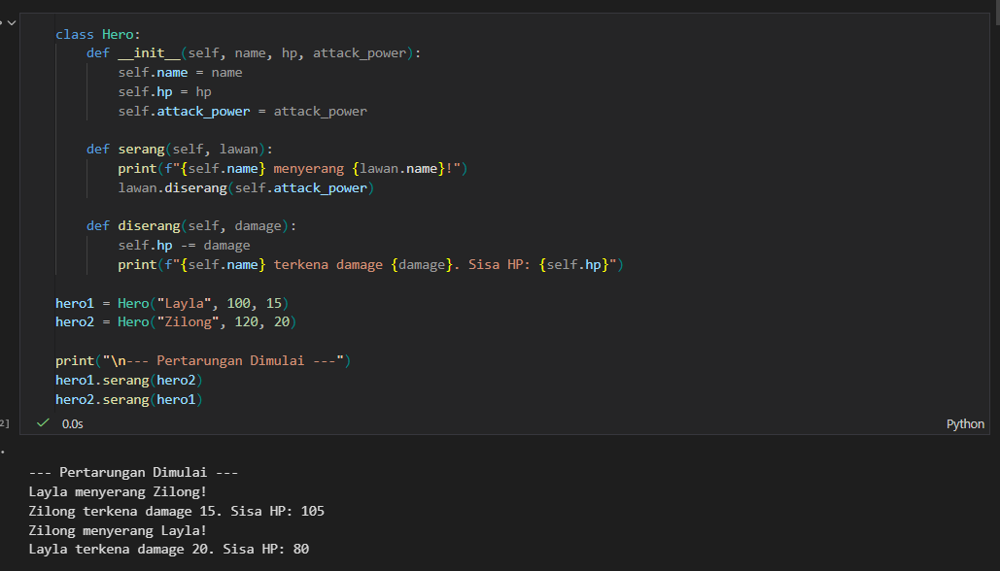
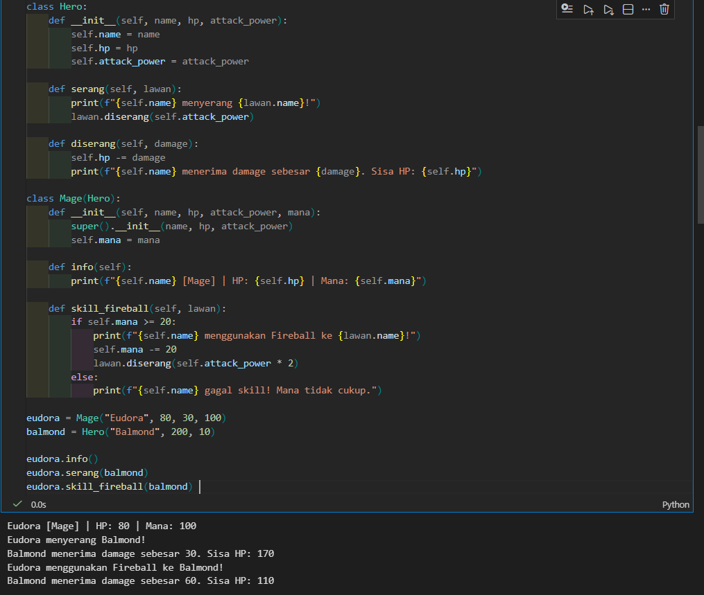
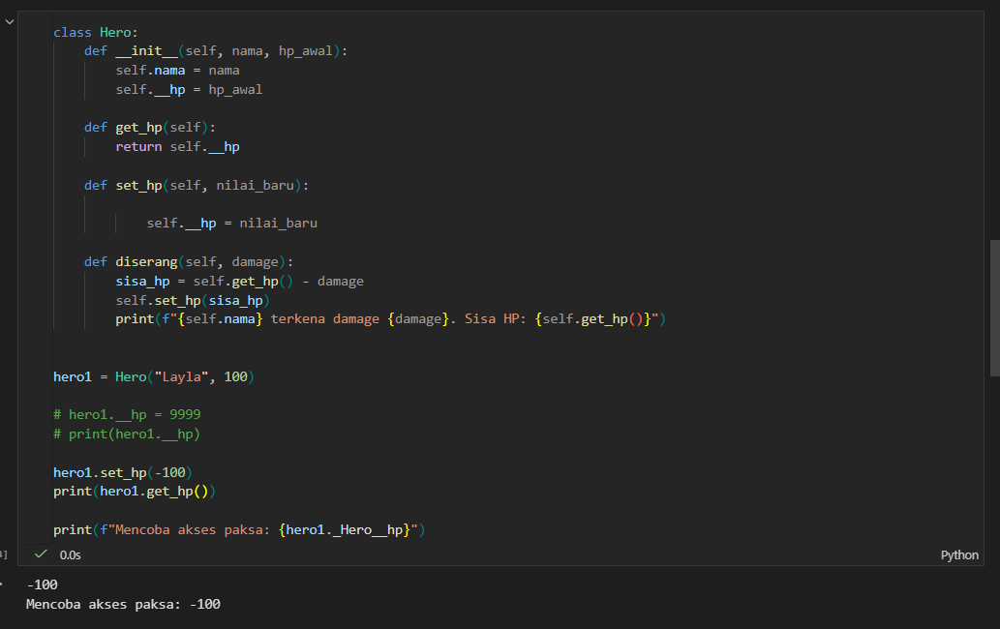
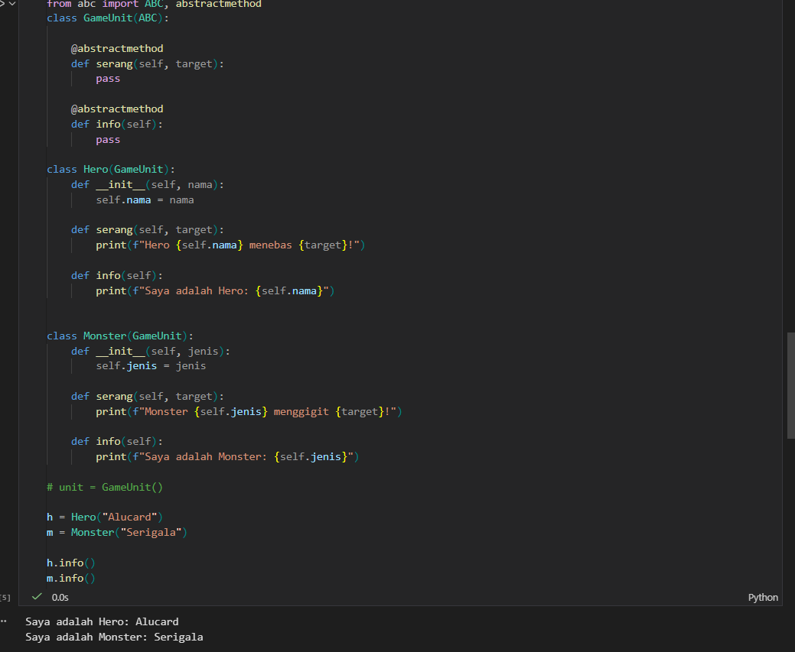
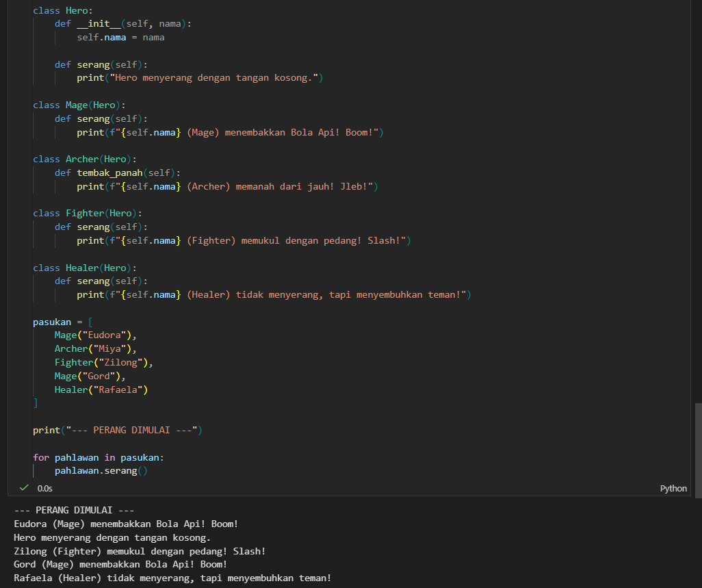

# Create README.md using pypandoc as required
# 📘 Analisis Modul OOP Python

## Analisis 1

Jika nilai hero1.hp diubah menjadi 500, maka HP milik objek hero1 akan berubah dari HP awal menjadi 500. Saat print(hero1.hp) dijalankan, program akan menampilkan angka 500.

Hal ini terjadi karena atribut hp bersifat publik sehingga dapat diubah langsung dari luar class tanpa pembatasan atau validasi.

## Analisis 2

Parameter lawan pada method serang() menerima sebuah objek, bukan hanya string nama, karena objek memiliki atribut dan method yang bisa digunakan.

Jika hanya mengirimkan string seperti "Zilong", maka kita tidak bisa mengakses atau mengurangi HP miliknya. Dengan mengirim objek secara langsung, method serang() bisa memanggil lawan.diserang(self.attack_power) sehingga terjadi interaksi antar objek.

Ini menunjukkan konsep OOP bahwa objek dapat saling berinteraksi.

## Analisis 3

Jika baris super().__init__(name, hp, attack_power) dihapus pada class Mage, maka akan muncul error:

AttributeError: 'Mage' object has no attribute 'name'

Hal ini terjadi karena constructor milik parent class (Hero) tidak dijalankan, sehingga atribut name, hp, dan attack_power tidak pernah dibuat.

Fungsi super() berperan untuk memanggil constructor class induk agar atribut dan method dari parent dapat diwariskan dengan benar ke class anak.

## Analisis 4
Bagian 1

Jika mencoba mengakses:

print(hero1._Hero__hp)

Nilai HP tetap dapat muncul. Hal ini terjadi karena Python menggunakan sistem Name Mangling, yaitu mengubah __hp menjadi _Hero__hp.

Walaupun bisa diakses, cara ini tidak disarankan karena melanggar prinsip Encapsulation dan standar pemrograman yang baik.

Bagian 2

Jika logika validasi pada method set_hp() dihapus dan hanya berisi:

self.__hp = nilai_baru

Kemudian dijalankan hero1.set_hp(-100), maka HP akan menjadi -100.

Hal ini membuktikan bahwa method setter sangat penting untuk menjaga integritas data agar tidak negatif atau dimanipulasi.

## Analisis 5

Jika method serang() dihapus dari class Hero yang mewarisi GameUnit, maka akan muncul error:

TypeError: Can't instantiate abstract class Hero with abstract method serang

Error tersebut berarti class Hero belum memenuhi kontrak dari abstract class GameUnit. Semua method abstrak wajib diimplementasikan.

Jika mencoba membuat objek dari GameUnit secara langsung:

unit = GameUnit()

akan muncul error karena abstract class tidak boleh diinstansiasi. Abstract class hanya berfungsi sebagai blueprint atau kerangka dasar.

## Analisis 6

Jika menambahkan class baru seperti Healer tanpa mengubah looping:

for pahlawan in pasukan:
    pahlawan.serang()

Program tetap berjalan dengan lancar selama method serang() ada di class tersebut.

Hal ini menunjukkan keuntungan Polymorphism, yaitu sistem tetap berjalan tanpa perlu mengubah kode lama ketika menambahkan fitur baru.

Namun, jika nama method pada salah satu class diubah (misalnya serang() menjadi tembak_panah()), maka akan muncul error karena looping memanggil method serang() yang sudah tidak ada.

Dalam Polymorphism, nama method harus konsisten agar dapat dipanggil secara umum.